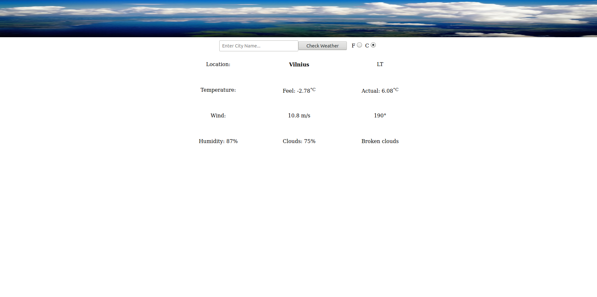

> This weather app was built using Odin and Micorverse resources. It uses JavaScript to connect to a weather app and display the weather in any of the cities available to that app. 

## Project Description

The project is a simple weather app designed to find various features of weather around the world. By simply inputting the name of a city and clicking enter, you can have the world's weather at your fingertips.

#### Features

-   Easy search function, simply input a city name and press Enter
-   Imperial / Metric unit conversion by selecting `F` or `C` next to the search bar
-   Clear easy to read display of the most vital aspects of the local weather

##### Weather Displayed

-   Temperature Feel
-   Actual Temperature
-   Wind Speed
-   Wind Direction
-   Humidity Level
-   Cloud Coverage
-   Sky Description

###### Future Features

-   Connect to database for search suggestions of typed input
-   Display additional weather aspects
-   Enhanced styling

## 

## Built With

-   JavaScript ES6 / HTML / SCSS
-   WebPack
-   Atom
-   Ubuntu

## Deployed on:

## Prerequisities

To get this project up and running locally, you must have node and npm installed on your computer.

## Getting Started

**To get this project set up on your local machine, follow these simple steps:**

**Step 1** 
Navigate to the local folder where you want the repository to be cloned and run
`git clone https://github.com/defoebrand/weather-app.git`. 

**Step 2** 
Next, run `cd weather-app`. 

**Step 3** 
Run `npm install` to install the packages from the `package.json`. 

**Step 4** 
Run `npm start` to begin the server. 

**Step 5** 
Navigate to `http://localhost:3000/` in a browser of your choice to see the application running 

## Authors

👤 **Brandon Defoe**

-   Github: [@defoebrand](https://github.com/defoebrand)
-   LinkedIn: [@defoebrand](https://www.linkedin.com/in/defoebrand/)
-   Gmail: <mailto:defoe.brand@gmail.com>

## 🤝 Contributing

Our favorite contributions are those that help us improve the project, so please leave an issue or a feature request if you have any suggestions!

Feel free to check the [issues page](https://github.com/defoebrand/weather-app/issues) to either create an issue or help us out by fixing an existing one.

## Show your support

If you've read this far....give us a ⭐️!

## :clap: Acknowledgements

-   Microverse
-   OdinProject

## 📝 License

This project is licensed by Microverse and the Odin Project
